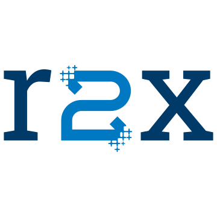

#### r2x-cli
<p><small>Plugin manager and pipeline runner for model interoperability.</small></p>

[](https://github.com/NatLabRockies/r2x-cli/actions/workflows/build.yml) [](https://github.com/NatLabRockies/r2x-cli/releases/latest) [](https://github.com/NatLabRockies/r2x-cli/commits/main) [](docs/README.md)
<br/>
[](docs/development.md) [](docs/development.md) [](https://docs.astral.sh/uv/) [](./LICENSE.txt)

<br/>

`r2x-cli` is a Rust CLI that discovers Python plugins, composes them into
repeatable pipelines, and manages the Python runtime with `uv`.
It keeps model data and sidecar artifacts together across process boundaries.

## Quick Start

### Install

macOS and Linux:

```bash
curl -fsSL https://github.com/NatLabRockies/r2x-cli/releases/latest/download/r2x-installer.sh | sh
```

Windows PowerShell:

```powershell
powershell -ExecutionPolicy Bypass -c "irm https://github.com/NatLabRockies/r2x-cli/releases/latest/download/r2x-installer.ps1 | iex"
```

Verify the installation:

```bash
r2x --version
```

## Documentation

Use the guide that matches your task:

- [Getting started](docs/getting-started.md): install, initialize, and run a pipeline.
- [CLI reference](docs/cli-reference.md): commands, flags, runtime behavior, and help.
- [Plugin management](docs/plugin-management.md): install, inspect, upgrade, and remove plugins.
- [Architecture](docs/architecture.md): Rust crates, runtime boundaries, discovery, and artifacts.
- [Development](docs/development.md): source builds, checks, Python ABIs, and troubleshooting.

See the [documentation index](docs/README.md) for the complete guide map.

## Development

Install Rust, `uv`, Python 3.11 or newer, and `just`.
Run the aggregate check with:

```bash
just all
```

See [Development](docs/development.md) for targeted formatting, lint, build, and test commands.

## License

BSD-3-Clause.
See [LICENSE.txt](./LICENSE.txt) for the full license text.
