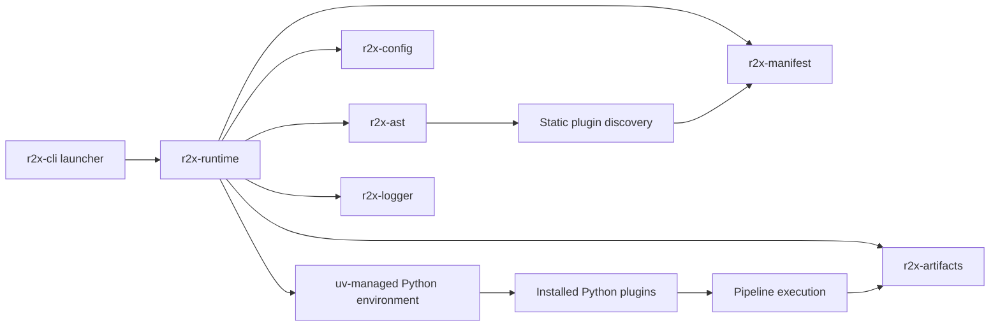

# r2x-cli Architecture

`r2x-cli` is a Rust CLI product for model interoperability. It keeps plugin discovery,
package management, pipeline execution, and Python runtime setup behind one
command-line interface.

## Runtime flow

The installed `r2x` command is the r2x-cli launcher. The adjacent
`r2x-runtime` payload contains the CLI implementation. Commands that do not
need Python, such as `r2x --version`, can run without creating the managed
environment. r2x-cli plugin installation, discovery, pipeline execution, and
system inspection use the `uv`-managed environment.

## Workspace crates

| Crate | Responsibility |
| --- | --- |
| `r2x-cli` | Command definitions, plugin management, pipeline execution, and system inspection. |
| `r2x-config` | Configuration paths, Python version selection, `uv` discovery, and virtual environment management. |
| `r2x-manifest` | Plugin manifest storage, package metadata, and runtime bindings. |
| `r2x-ast` | Static analysis of installed Python packages to discover plugin entry points. |
| `r2x-python` | PyO3 bridge and plugin invocation through the managed Python runtime. |
| `r2x-artifacts` | JSON and ZIP artifact handoff, sidecar directories, and durable pipeline boundaries. |
| `r2x-logger` | Structured logging, verbosity, log files, and plugin output handling. |
| `r2x-build-support` | Build-time Python ABI detection and validation for PyO3 builds. |

## Plugin discovery

r2x-cli does not import every installed plugin to build its manifest. The AST
scanner reads package files and records the plugin metadata needed to invoke
entry points later. This keeps installation and synchronization from executing
arbitrary plugin import side effects.

The manifest records r2x package and plugin metadata, including source
information, module names, callable names, configuration modules, and plugin
roles. At run
time, the manifest is resolved to Python call targets and the selected plugin
runs inside the managed environment.

## Pipeline boundaries

A pipeline can pass a System through a Unix pipe when all steps belong to one
job. The producer writes JSON to stdout, sidecars are kept in r2x-cli's
cache-backed location, and diagnostics are written to stderr.

Use `-o` and `-i` when the boundary must survive across jobs or be tracked by a
workflow manager. A durable JSON entrypoint is stored beside its
`<stem>_time_series/` directory. Keep the entrypoint and sidecars together.
See [Torc plugin streams](torc-plugin-streams.md) for examples.
